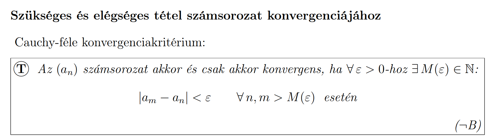
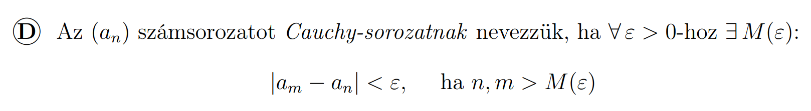
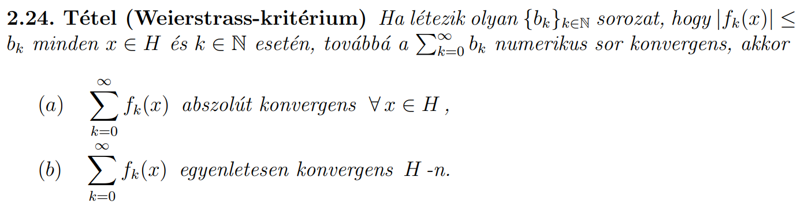

# Konvergenciakritériumok sorok esetében

Aktuális elemmel tartunk hova?

## Szükséges és elégséges feltételek

- Cauchy-kritérium

Egy sorozat akkor és csak akkor konvergens, ha Cauchy, azaz ha bármilyen kis $\varepsilon{}$-hoz létezik olyan küszöbindex, hogy a sorozat azt követő bármely két elemének a távolsága kisebb, mint $\varepsilon{}$.

# Konvergenciakritériumok sorösszegek esetében

## Konkrét sorok

$\sum\limits_{n=1}^{\infty{}} \frac{1}{n^x}$
- Konvergens, ha $x>1$.
  - Pl. $\sum\limits_{n=1}^{\infty{}} \frac{1}{n^2} = \frac{\pi^2}{6}$: A négyzetszámok reciprokösszege $\frac{\pi^2}{6}$.
- Divergens, ha $x\leq{}1$.

## Bármilyen sorösszegek

### Szükséges feltételek

Ha nem teljesül, akkor divergens. (Ha teljesül akkor nem tudjuk.)

- Egy sor csak akkor tud konvergens lenni, ha az elemei $0$-ba tartanak.  
  $\lim\limits_{k\rightarrow{}\infty}a_k = 0$ szükséges, hogy $\sum\limits_{k=0}^{\infty} a_k$ konvergens lehessen.

### Elégséges feltételek

- Abszolút konvergenciából következik a konvergencia.  
  $\sum\limits_{k=1}^{\infty} |a_k|$ konvergens $\Rightarrow$ $\sum\limits_{k=1}^{\infty} a_k$ konvergens

- Weierstrass kritérium.

## Pozitív előjelű sorok összegei

### Szükséges és elégséges feltételek

Ha teljesül, akkor konvergens. Ha nem teljesül, akkor divergens.

- Pozitív előjelű sor esetében a részletösszegek sorozata egyre növekvő lesz. Ha ez a részletösszeg sorozat korlátos, akkor konvergens, ha nem korlátos akkor divergens.
  - Ha van olyan $C$ konstans, hogy $\forall{}n$ $\sum\limits_{k=0}^{n}a_k < C$, akkor konvergens, ha nincs akkor divergens.

### Elégséges feltételek

Itt van ami konvergenciára, van ami divergenciára vonatkozik. Ha teljesül akkor konvergens/divergens. (Ha nem teljesül akkor nem tudjuk.)

Minden kritériumra itt feltétel: $a_n > 0$ $\forall{}n$

- **Majoráns / Minoráns kritérium**:
  - Konvergenciára (majoráns): Sor elemei felülről becsülhetők egy konvergens sor elemeivel.  
    Ha $0 < a_n \leq{} c_n$ $\forall{}n$ és $\sum\limits_{n=1}^{\infty}c_n$ konvergens $\Rightarrow$ $\sum\limits_{n=1}^{\infty}a_n$ konvergens.
  - Divergenciára (minoráns): Sor elemei alulról becsülhetők egy divergens sor elemeivel.  
    Ha $0 < d_n \leq{} a_n$ $\forall{}n$ és $\sum\limits_{n=1}^{\infty}d_n$ divergens $\Rightarrow$ $\sum\limits_{n=1}^{\infty}a_n$ divergens.
- **Hányados kritérium**:
  - Konvergenciára: Egy konvergens mértani sor kvóciensével becslünk felülről. Ha a kvóciens $<1$ akkor konvergens.  
    - Ha $\frac{a_{n+1}}{a_n} \leq{} q < 1$ $\Rightarrow$ $\sum\limits_{n=1}^{\infty}a_n$ konvergens.
    - Ha $\lim\limits_{n\rightarrow{}\infty{}}\frac{a_{n+1}}{a_n} = c < 1$ $\Rightarrow$ $\sum\limits_{n=1}^{\infty}a_n$ konvergens.
  - Divergenciára: Egy divergens mértani sor kvóciensével becslünk alulról. Ha a kvóciens $\geq{}1$ akkor divergens.
    - Ha $\frac{a_{n+1}}{a_n} \geq{} q \geq{} 1$ $\Rightarrow$ $\sum\limits_{n=1}^{\infty}a_n$ divergens.
    - Ha $\lim\limits_{n\rightarrow{}\infty{}}\frac{a_{n+1}}{a_n} = c > 1$ $\Rightarrow$ $\sum\limits_{n=1}^{\infty}a_n$ konvergens.
      - $c=1$ esetében NEM TUDJUK, külön megnézni!
- **Gyökkritérium**:
  - Konvergenciára: Egy konvergens mértani sorral becslünk felülről. Ha a kvóciens $<1$ akkor konvergens.
    - Ha $\sqrt[n]{a_n} \leq{} q < 1$ $\Rightarrow$ $\sum\limits_{n=1}^{\infty}a_n$ konvergens.
    - Ha $\lim\limits_{n\rightarrow{}\infty{}}\sqrt[n]{a_n} = c < 1$ $\Rightarrow$ $\sum\limits_{n=1}^{\infty}a_n$ konvergens.
  - Divergenciára: Egy divergens mértani sorral becslünk felülről. Ha a kvóciens $\geq{}1$ akkor divergens.
    - Ha $\sqrt[n]{a_n} \geq{} q \geq{} 1$ $\Rightarrow$ $\sum\limits_{n=1}^{\infty}a_n$ divergens.
    - Ha $\lim\limits_{n\rightarrow{}\infty{}}\sqrt[n]{a_n} = c > 1$ $\Rightarrow$ $\sum\limits_{n=1}^{\infty}a_n$ divergens.
      - $c=1$ esetében NEM TUDJUK, külön megnézni!
- **Integrálkritérium**: Szummát integrálásra átírjuk.  
  Ehhez $f(k) = a_k$ függvényt használunk ami $f(k)>0$ és monoton csökkenő.
  - Konvergenciára: $\int\limits_{1}^{\infty}f(x)dx$ konvergens $\Rightarrow$ $\sum\limits_{k=1}^{\infty}a_k$ konvergens.
  - Divergenciára: $\int\limits_{1}^{\infty}f(x)dx$ divergens $\Rightarrow$ $\sum\limits_{k=1}^{\infty}a_k$ divergens.

## Váltakozó előjelű sorok összegei

### Elégséges feltételek

Ha teljesül, akkor konvergens. (Ha nem teljesül akkor nem tudjuk.)

- **Leibniz-sor**: Váltakozó előjelű sor, aminek az abszolút
  értékeiből képzett sor monoton csökkenő és $0$-ba tart.
  Ez biztosan konvergens.
  - $\vert{}a_{n+1}\vert{} > \vert{}a_n\vert{}$ $\forall{}n$ és
    $\lim\limits_{n\rightarrow\infty} \vert{}a_n\vert{} = 0$
    $\Rightarrow$ $\sum\limits_{n=1}^{\infty}(-1)^n\vert{}a_n\vert{}$ konvergens, mert Leibniz.
    
## Hatványsorok összegei

$x_0$ középpontú (bázispontú) hatványsor:

$\sum\limits_{k=0}^{\infty}a_k(x-x_0)^k$

Itt az $x$ egy változó, $a_k$-k pedig konstans együtthatók.

Ezek úgy működnek, hogy:
- $x_0$ körül egy $R$ sugarú nyílt intervallumon lesznek abszolút konvergensek: $(x_0-R, x_0+R)$-en.
  - $x_0$-ban biztosan abszolút konvergensek.
  - $R=0$ a legkisebb és $R=\infty$ a legnagyobb lehetséges sugár.
- Az intervallum végpontjaiban lehet konvergens és divergens is, itt külön meg kell nézni: $x_1 = x_0-R$ és $x_2=x_0+R$ esetében.
- Az intervallumon kívül divergens.

### Konvergenciatartomány (sugár) meghatározása

$x_0 = 0$ -ra mutatom miért, de a többire is így kell:

- **Gyökkritériummal**: $\limsup \sqrt[n]{\vert{}a_n\vert{}\vert{}x\vert{}^n} = \vert{}x\vert{} \limsup \sqrt[n]{\vert{}a_n\vert{}} = \vert{}x\vert{}\alpha = q < 1$ ha konvergens, tehát $\vert{}x\vert{} < \frac{1}{\alpha} = R$ esetében konvergens.
- **Hányados kritériummal** $\limsup \frac{\vert{}a_{n+1}\vert{}\vert{}x\vert{}^{n+1}}{\vert{}a_n\vert{}\vert{}x\vert{}^{n}} = \vert{}x\vert{} \limsup \frac{\vert{}a_{n+1}\vert{}}{\vert{}a_n\vert{}} = \vert{}x\vert{}\alpha = q < 1$ ha konvergens, tehát $\vert{}x\vert{} < \frac{1}{\alpha} = R$ esetében konvergens.

Szóval tulajdonképpen az $\vert{}a_k\vert{}$ sorozatra kell a gyökkritérium/hányadoskritérium képletét használni, annak lesz valami határértéke ($\alpha$) és annak a reciproka a konvergenciasugár ($R = \frac{1}{\alpha}$).
