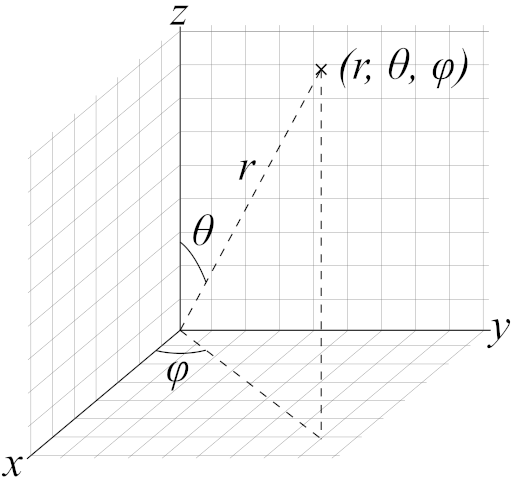
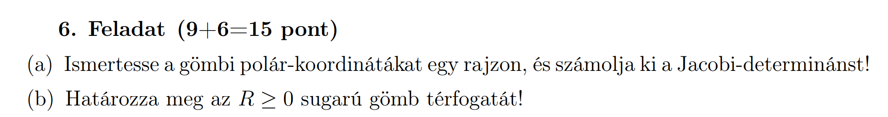
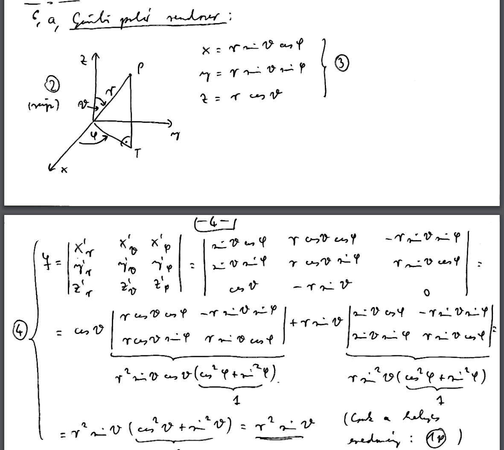
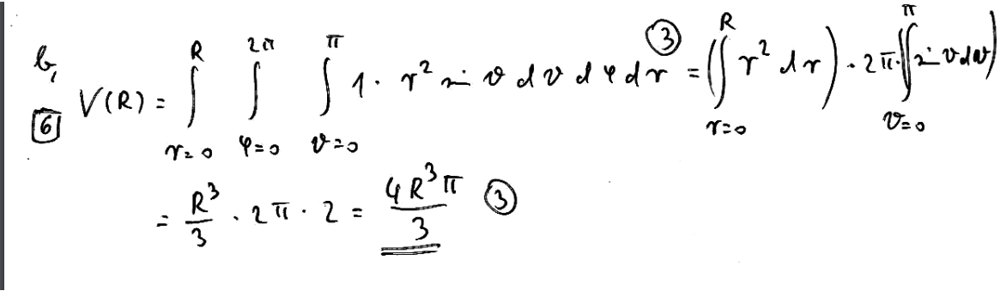
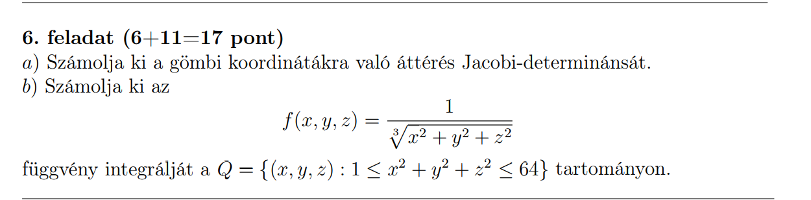
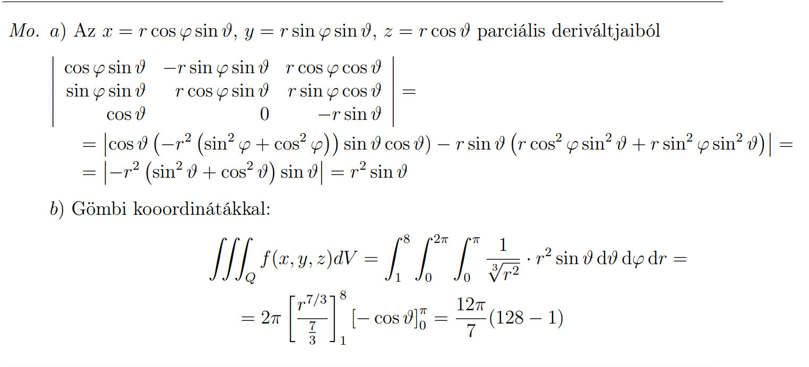
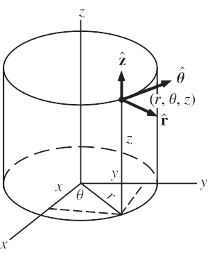
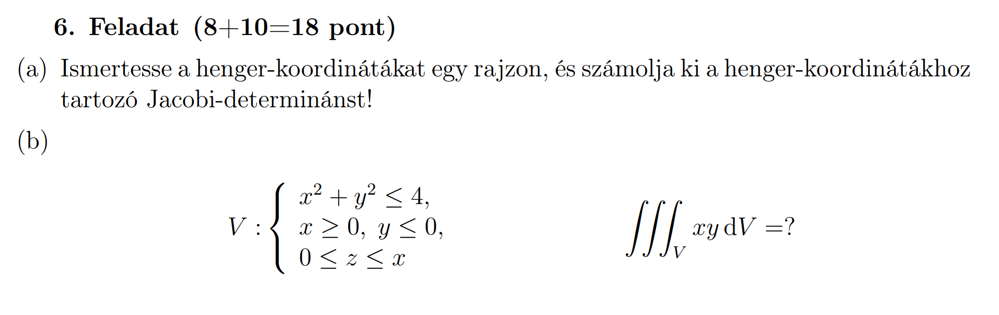
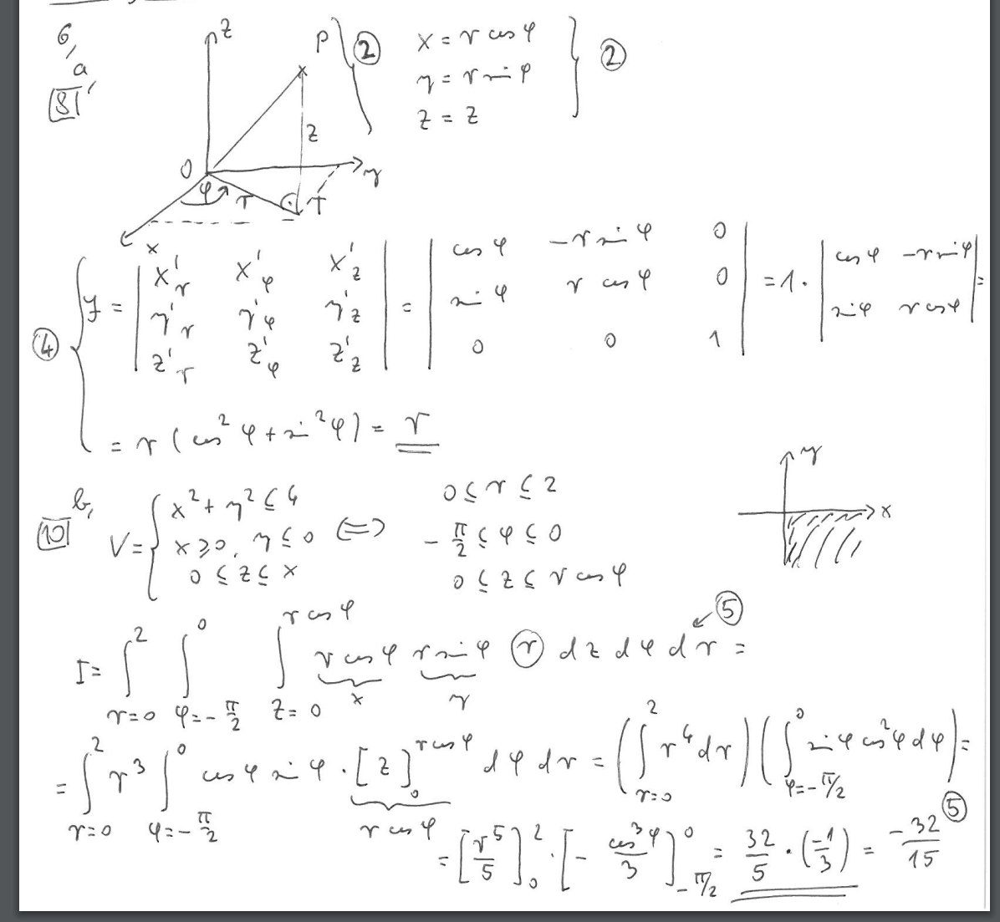

# Koordinátarendszerek

## Jakobi determináns számolása

|   | r |            $\vartheta$            | $\varphi$ |
| - | - | --------------------------------- | --------- |
| x |   |                                   |           |
| y |   | $\frac{\partial{}i}{\partial{}j}$ |           |
| z |   |                                   |           |

## Gömbi koordináták

$x = r\cdot{}sin(\vartheta)\cdot{}cos(\varphi)$  
$y = r\cdot{}sin(\vartheta)\cdot{}sin(\varphi)$  
$z = r\cdot{}cos(\vartheta)$

$det(J) = r^2sin(\vartheta)$

### Gömbi koordináták - Feladat

[2017. június 7. Alfa variáns (Feladatsor)](https://vik.wiki/images/3/3b/Analszigo_20170607a.pdf)

### Gömbi koordináták - Megoldás

[2017. június 7. Alfa variáns (Megoldókulcs)](https://vik.wiki/images/b/bb/Analszigo_20170607_megold.pdf)

### Bónusz példa

#### Bónusz példa - Feladat

[2019. május 29. Alfa variáns (Feladatsor)](https://vik.wiki/images/4/4a/Analsziginfo2019_1a.pdf)

### Bónusz példa - Megoldás

[2019. május 29. Alfa variáns (Megoldókulcs)](https://vik.wiki/images/7/7b/Analsziginfo2019_1a_megold.pdf)

## Henger koordináták

$x = r\cdot{}cos(\varphi)$  
$y = r\cdot{}sin(\varphi)$  
$z = z$

$det(J) = r$

### Henger koordináták - Feladat

[2017. május 24. Alfa variáns (Feladatsor)](https://vik.wiki/images/4/44/Analszigo_20170524a.pdf)

### Henger koordináták - Megoldás

[2017. május 24. Alfa variáns (Megoldókulcs)]([https://vik.wiki/images/4/44/Analszigo_20170524a.pdf](https://vik.wiki/images/8/86/Analszigo_20170524_megold.pdf))

