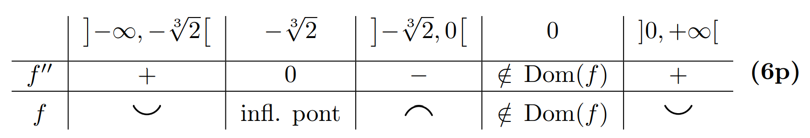

# Deriválás

$ ln'(\vert{}x\vert{}) = \frac{1}{x} $

[Derivált táblázat](derivalt_tablazat.pdf)

## Összefüggések

$( f\cdot{}g )' = f'g + fg'$

$( \frac{f}{g} )' = \frac{f'g - fg'}{g^2}$

# Lokális szélsőértékhelyek számolása

## 1 dimenzióban

$f(x)$ szélsőértékei:

// Kell: f kétszer deriválható (x)-ben.
- Inflexiós pont: Kétszeres derivált 0. EGYSZERES DERIVÁLT NEM SZÁMÍT!
  - $f'\'(x) = 0$
  - $f'\'(x) > 0$ POZITÍV: Konvex: Vidám. :)
  - $f'\'(x) < 0$ NEGATÍV: KonkáViki: Szomorú mert nem tudja megjegyezni. :(

- Szélsőérték: Egyszeres derivált 0, de ez még lehet hogy inflexiós pont.
  - $f'(x) = 0$: Lokális szélsőérték vagy inflexiós pont.
    - $f'\'(x) > 0$: POZITÍV: Lokális minimum.
    - $f'\'(x) < 0$: NEGATÍV: Lokális maximum.
    - $f'\'(x) = 0$: ZÉRÓ: Inflexiós pont.

## 2 dimenzióban

$f(x,y)$ szélsőértékei:

// Kell: f kétszer totálisan deriválható (x,y)-ban.

- Egyszeres deriváltak = Gradiens vektor: $grad(f(x,y)) = \begin{pmatrix} f'\_x & f'\_y \end{pmatrix}$.
  -  $grad(f) = (0,0)$: Lokális szélsőérték vagy nyeregpont vagy nem tudjuk.
- Kétszeres deriváltak = Hesse mátrix: $H(f(x,y)) = \begin{pmatrix} f'\'\_{xx} & f'\'\_{xy}\\\ f'\'\_{yx} & f'\'\_{yy}\end{pmatrix}$ // $\rightarrow{} (f'\'\_{xy} = f'\'\_{yx})$
  - $det(H(f)) > 0$: Lokális szélsőérték.
    - $f'\'\_{xx} > 0$: Lokális minimum.
    - $f'\'\_{xx} < 0$: Lokális maximum.
    - $f'\'\_{xx} = 0$: Nem fordulhat elő. (H szimmetrikus.)
  - $det(H(f)) < 0$: Nyeregpont.
  - $det(H(f)) = 0$: Próba nem járt sikerrel. (Lehet van szélsőérték, lehet nincs, ez a tétel nem tudja eldönteni.)
