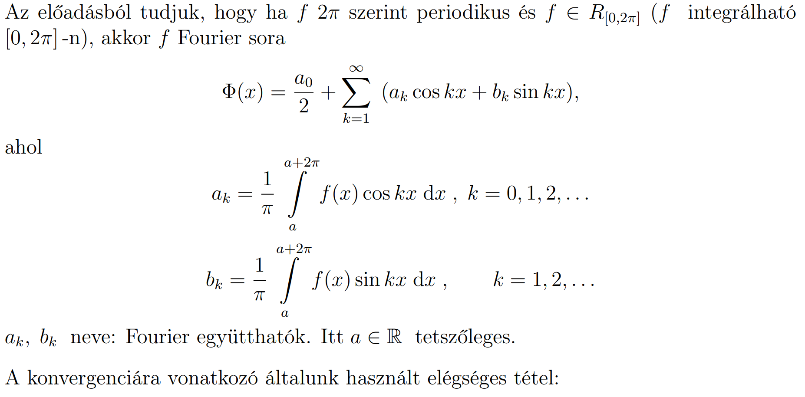
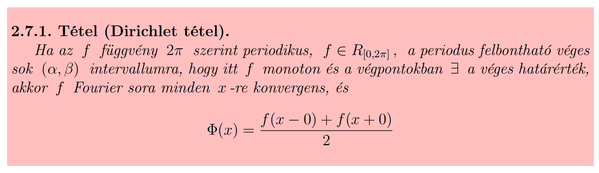
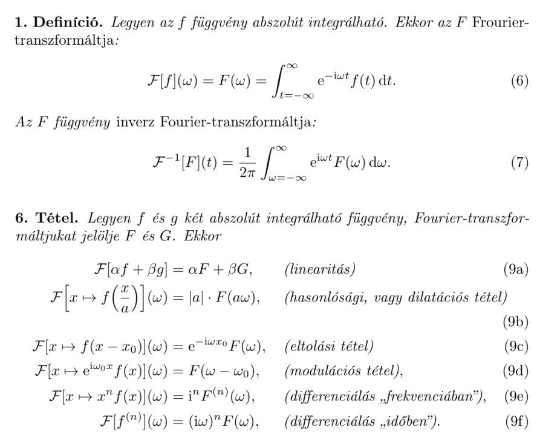

# Fourier

## Fourier-sor

$\Phi(x) = \frac{a_0}{2} + \sum\limits_{k=1}^{\infty} (a_k\cdot{}cos(kx) + b_k\cdot{}sin(kx))$

$a_k = \frac{1}{\pi} \int\limits_{0}^{2\pi} f(x)\cdot{}cos(kx)~dx$, ahol $k=0,1,2,\cdots{}$  
$b_k = \frac{1}{\pi} \int\limits_{0}^{2\pi} f(x)\cdot{}sin(kx)~dx$, ahol $k=1,2,\cdots{}$

## Dirichlet-tétel (5/2)

Feltételek: PIF MOHA

- Periodikus ($2\pi$-n)
- Integrálható ($[0,2\pi]$-n)
- Felbontható ($[0,2\pi]$ véges sok $[\alpha,\beta]$-ra)
  - Monoton ($f(x)$ $[\alpha,\beta]$-n)
  - Határérték a végpontokban létezik és VÉGES ($f(\alpha+0)$ és $f(\beta-0)$ létezik és véges)

Következmények: A Fourier-sora ekkor:

- Pontonként konvergens (mindenhol)
- $\Phi(x) = \frac{f(x-0)+f(x+0)}{2}$

## Fourier-transzformáció

$\mathcal{F}(\omega) = \int\limits_{-\infty{}}^{\infty{}}f(x)\cdot{}e^{-i\omega{}x}~dx$

Inverz:

$f(x) = \frac{1}{2\pi{}}\int\limits_{-\infty{}}^{\infty{}}\mathcal{F}(\omega)\cdot{}e^{i\omega{}x}~d\omega{}$

