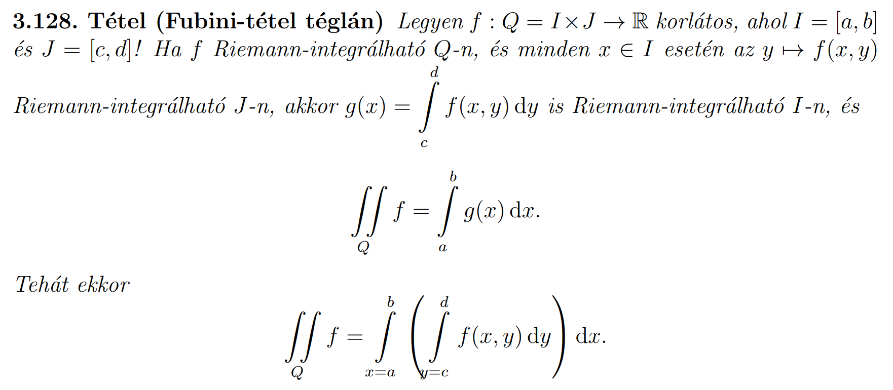

# Integrálás

## Fubini-tétel

Van egy korlátos $f(x,y)$ függvényem $Q=[a,b]\times{}[c,d]$ területen. $Q$ szerinti integrált át tudom írni $x$, majd azon belül $y$ szerintivé, ha:
- Egyrészt $f(x,y)$ (Riemann-)integrálható $Q$ szerint.
- Veszem az összes $x_0 \in{} [a,b]$ pontot és a hozzá tartozó $f_{x_0}(y) = f(x_0, y)$ **egyváltozós** függvényt ki tudom (Riemann-)integrálni $[c,d]$-n.
- Majd az ezekből a függvényekből kapott $g(x) = \int\limits_{c}^{d}f(x,y)dy$ **egyváltozós** függvényt meg utána ki tudom (Riemann-)integrálni $[a,b]$-n.
