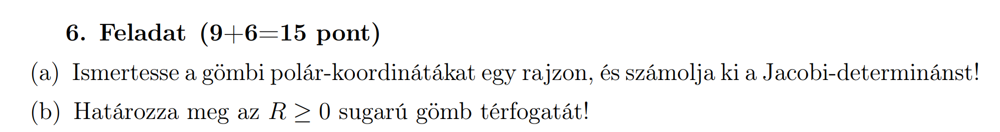
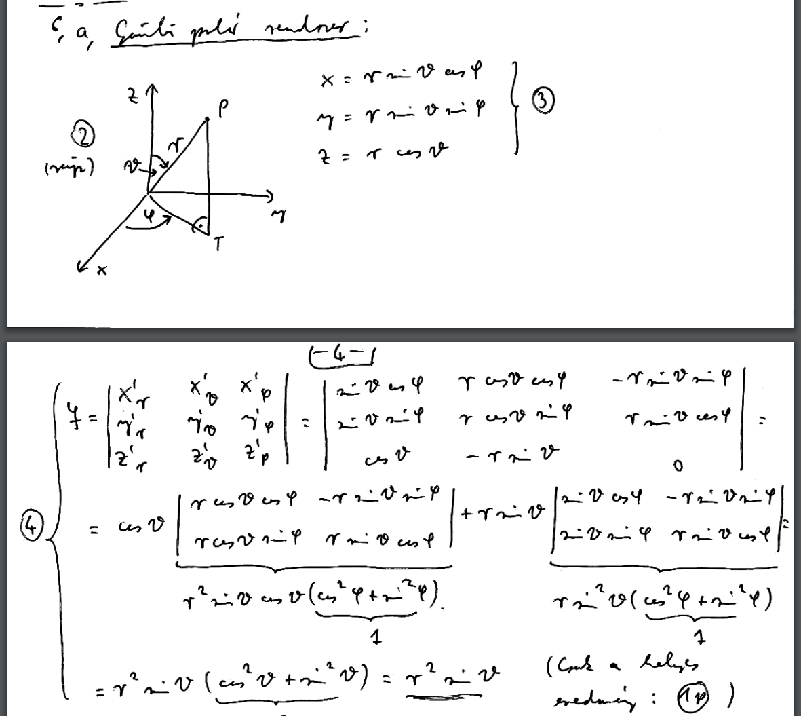
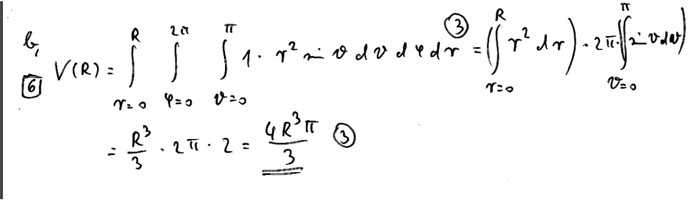
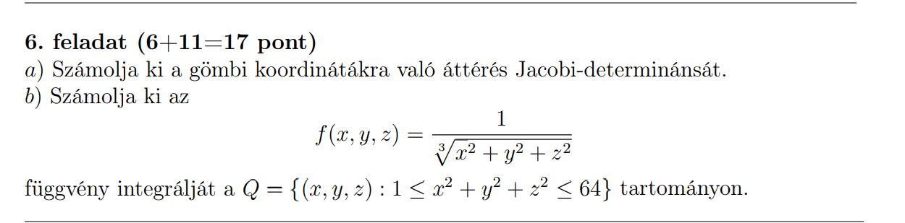
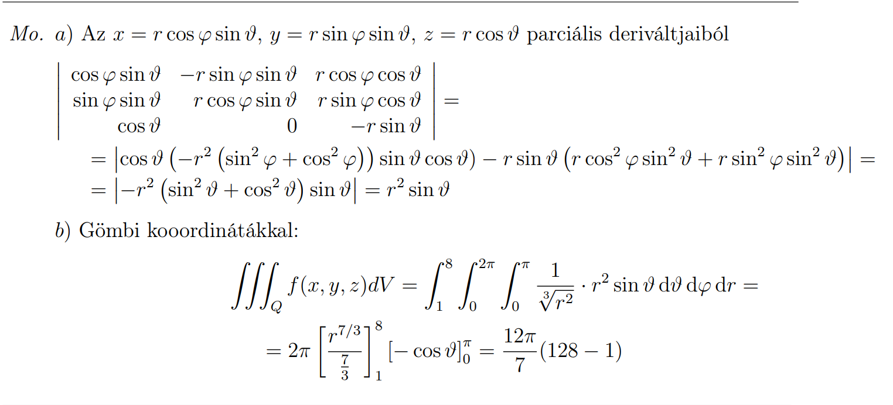
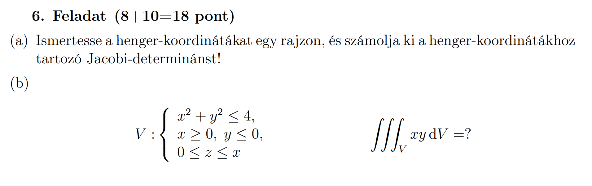
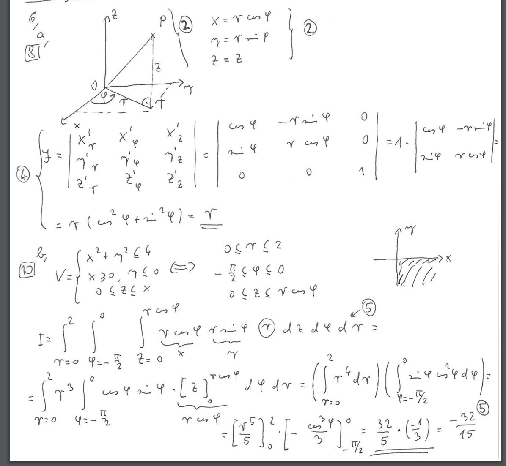

# Gömbi koordináták

## Feladat

[2017. június 7. Alfa variáns (Feladatsor)](https://vik.wiki/images/3/3b/Analszigo_20170607a.pdf)

## Megoldás

[2017. június 7. Alfa variáns (Megoldókulcs)](https://vik.wiki/images/b/bb/Analszigo_20170607_megold.pdf)

## Bónusz példa

### Feladat

[2019. május 29. Alfa variáns (Feladatsor)](https://vik.wiki/images/4/4a/Analsziginfo2019_1a.pdf)

## Megoldás

[2019. május 29. Alfa variáns (Megoldókulcs)](https://vik.wiki/images/7/7b/Analsziginfo2019_1a_megold.pdf)

# Henger koordináták

## Feladat

[2017. május 24. Alfa variáns (Feladatsor)](https://vik.wiki/images/4/44/Analszigo_20170524a.pdf)

## Megoldás

[2017. május 24. Alfa variáns (Megoldókulcs)]([https://vik.wiki/images/4/44/Analszigo_20170524a.pdf](https://vik.wiki/images/8/86/Analszigo_20170524_megold.pdf))

