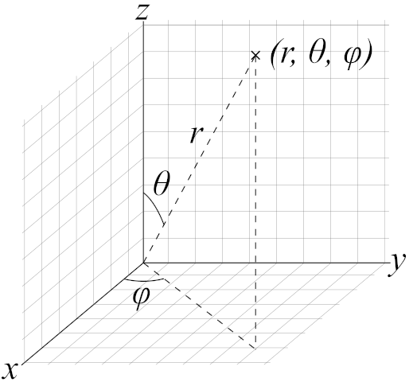
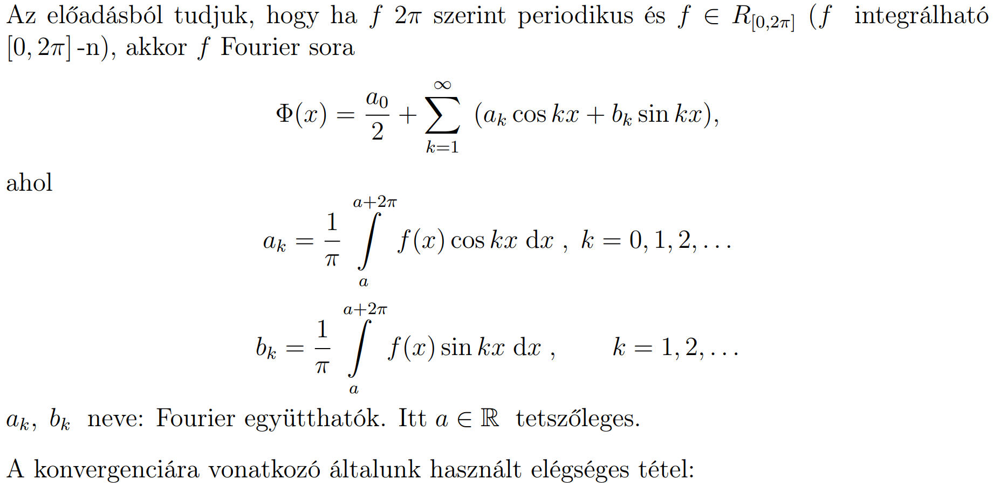
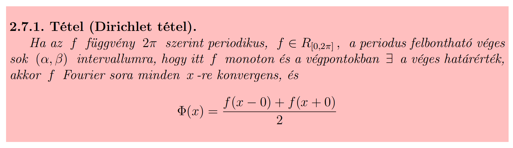

# Komplex számok

## Komplex gyök számítás

Keressük

$ z^n = r \cdot{} (cos(\alpha) + i\cdot{}sin(\alpha)) $  

$n.$ gyökét, amiből $n$ darab van, a $k.$ gyök:

$ z_k = \sqrt[n]{r}\cdot{}(cos(\frac{\alpha{}+2k\pi{}}{n}) + i\cdot{}sin(\frac{\alpha{}+2k\pi{}}{n})) $

# Polinomok

## Másodfokú egyenlet megoldóképlete

$ ax^2 + bx + c = 0  $

$ x_{1,2} = \frac{-b \pm{} \sqrt{b^2 - 4ac}}{2a} $

# Deriválás

$ ln'(|x|) = \frac{1}{x} $

$ ( \frac{f}{g} )' = \frac{f'g - fg'}{g^2} $

# Koordinátarendszerek

[Jakobi-determinánsos számolások](./assets/koordinatarendszerek.md)

## Gömbi koordináták

$ x = r\cdot{}sin(\vartheta)\cdot{}cos(\varphi) $  
$ y = r\cdot{}sin(\vartheta)\cdot{}sin(\varphi) $  
$ z = r\cdot{}cos(\vartheta)$

### Jakobi-determinánsa

$ r^2sin(\vartheta) = $

|   | r |            $\vartheta$            | $\varphi$ |
| - | - | --------------------------------- | --------- |
| x |   |                                   |           |
| y |   | $\frac{\partial{}i}{\partial{}j}$ |           |
| z |   |                                   |           |

## Henger koordináták

$ x = r\cdot{}cos(\varphi)$  
$ y = r\cdot{}sin(\varphi)$  
$ z = z $

### Jakobi-determinánsa

$r = $

|   | r |            $\vartheta$            | $\varphi$ |
| - | - | --------------------------------- | --------- |
| x |   |                                   |           |
| y |   | $\frac{\partial{}i}{\partial{}j}$ |           |
| z |   |                                   |           |

# Trigonometria

$ sin(x+y) = sin(x)cos(y) + cos(x)sin(y) $  
$ sin(x-y) = sin(x)cos(y) - cos(x)sin(y) $  
$ cos(x+y) = cos(x)cos(y) - sin(x)sin(y) $  
$ cos(x-y) = cos(x)cos(y) + sin(x)sin(y) $

$ cos^2(x)+sin^2(x) = 1 $

$ sin(2x) = 2sin(x)cos(x) $  
$ cos(2x) = cos^2(x) - sin^2(x) $

$ cos^2(x) = \frac{1+cos(2x)}{2} $  
$ sin^2(x) = \frac{1-cos(2x)}{2} $

# Fourier-sor

$\Phi(x) = \frac{a_0}{2} + \sum\limits_{k=1}^{\infty} (a_k\cdot{}cos(kx) + b_k\cdot{}sin(kx)) $

$ a_k = \frac{1}{\pi} \int\limits_{0}^{2\pi} f(x)\cdot{}cos(kx)~dx $, ahol $ k=0,1,2,\cdots{} $  
$ b_k = \frac{1}{\pi} \int\limits_{0}^{2\pi} f(x)\cdot{}sin(kx)~dx $, ahol $ k=1,2,\cdots{} $

# Fourier-transzformáció

$ \mathcal{F}(\omega) = \int\limits_{-\infty{}}^{\infty{}}f(x)\cdot{}e^{-i\omega{}x}~dx $

Inverz:

$ f(x) = \frac{1}{2\pi{}}\int\limits_{-\infty{}}^{\infty{}}\mathcal{F}(\omega)\cdot{}e^{i\omega{}x}~d\omega{} $

# Dirichlet-tétel (5/2)

Feltételek: PIF MOHA

- Periodikus ($2\pi$-n)
- Integrálható ($[0,2\pi]$-n)
- Felbontható ($[0,2\pi]$ véges sok $[\alpha,\beta]$-ra)
  - Monoton ($f(x)$ $[\alpha,\beta]$-n)
  - Határérték a végpontokban létezik és VÉGES ($f(\alpha+0)$ és $f(\beta-0)$ létezik és véges)

Következmények: A Fourier-sora ekkor:

- Pontonként konvergens (mindenhol)
- $ \Phi(x) = \frac{f(x-0)+f(x+0)}{2} $

# Diffegyenletek megoldása

## Szeparálható

$ y' - f(x)g(y) = h(x) $

### Homogén általános megoldása

$ y' - f(x)g(y) = 0 $

$ y' = f(x)g(y) $

1. eset: Van olyan $k$ ahol $g(k) = 0$.
- Ilyenkor y(x) = k megoldás, mert:
  - $ y'(x) = 0 $
  - $ g(y(x)) = g(k) = 0 $
  - $ 0 = f(x)\cdot{}0 $

2. eset: $ g(k)\neq{}0 $
- Ilyenkor oszthatunk vele:
- $ \frac{dy}{dx} = f(x)g(y) $
- $ \int{}\frac{dy}{g(y)} = \int{}f(x){dx} $

### Inhomogén partikuláris megoldása

Állandó variálásával

- Kijön valami $ y_{H,Á}(x) = k\cdot{}m(x) $.
- Ekkor a partikuláris megoldást $ y_{I,P}(x) = k(x)\cdot{}m(x) $ alakban keressük.
- Visszahelyettesítjük ide: $ y' - f(x)g(y) = h(x) $.
  - Ez mindig olyan lesz, hogy a $k(x)$ kiesik és a $k'(x)$-et visszaintegráljuk.

## Lineáris n-edrendű

$ a_{n-1}y^{(n-1)} + \dots{} + a_2y'' + a_1y' + a_0 y = f(x) $

### Homogén általános megoldása

$ a_{n-1}y^{(n-1)} + \dots{} + a_2y'' + a_1y' + a_0 y = 0 $

Karakterisztikus egyenlet:

$ a_{n-1}\lambda{}^{n-1} + \dots{} + a_2\lambda{}^2 + a_1\lambda{} + a_0 = 0 $

Gyökök alapján: Az alábbi felsorolásból kieső $y(x)$-ek összege kell, különböző $k_i$ konstansokkal.

- $\lambda$ egyszeres valós gyök: ($1$ db megoldás lineáris kombinációja)
  - $ y_1(x) = k_1\cdot{}e^{\lambda{}x} $
- $\lambda$ $s$-szeres valós gyök: ($k$ db megoldás lineáris kombinációja)
  - $ y_1(x) = k_1\cdot{}e^{\lambda{}x} $
  - $ y_2(x) = k_2\cdot{}x\cdot{}e^{\lambda{}x} $
  - $\dots{}$
  - $ y_1(x) = k_s\cdot{}x^{s-1}\cdot{}e^{\lambda{}x} $
- $\alpha \pm{} \beta{}i$ egyszeres valós gyökpár: ($2$ db megoldás lineáris kombinációja)
  - $ y_1(x) = k_1\cdot{}e^{\lambda{}\alpha{}}\cdot{}cos(\beta{}x)$
  - $ y_2(x) = k_2\cdot{}e^{\lambda{}\alpha{}}\cdot{}sin(\beta{}x)$
- $\alpha \pm{} \beta{}i$ $s$-szeres valós gyökpár: ($2s$ db megoldás lineáris kombinációja)
  - $ y_1(x) = k_1\cdot{}e^{\lambda{}\alpha{}}\cdot{}cos(\beta{}x)$
  - $ y_2(x) = k_2\cdot{}e^{\lambda{}\alpha{}}\cdot{}sin(\beta{}x)$
  - $ y_3(x) = k_3\cdot{}x\cdot{}e^{\lambda{}\alpha{}}\cdot{}cos(\beta{}x)$
  - $ y_4(x) = k_4\cdot{}x\cdot{}e^{\lambda{}\alpha{}}\cdot{}sin(\beta{}x)$
  - $\dots{}$
  - $\dots{}$
  - $ y_{2s-1}(x) = k_{2s-1}\cdot{}x^{s-1}\cdot{}e^{\lambda{}\alpha{}}\cdot{}cos(\beta{}x)$
  - $ y_{2s}(x) = k_{2s-1}\cdot{}x^{s-1}\cdot{}e^{\lambda{}\alpha{}}\cdot{}sin(\beta{}x)$

### Inhomogén partikuláris megoldása

Kísérletezéssel, ugyanabból a függvényosztályból.

$ a_{n-1}y^{(n-1)} + \dots{} + a_2y'' + a_1y' + a_0 y = f(x) $

| $f(x)$ | $y_{I,P}(x)$ |
| - | - |
| $5$ | $A$ |
| $x^3+5x+2$ | $Ax^2+Bx+C$ |
| $cos(x)$ | $Acos(x) + Bsin(x)$ |
| $x^4sin(4x)$ | $(Ax^4+Bx^3+Cx^2+Dx+E)(Fcos(4x)+Gsin(4x))$ |
| $e^{7x}$ | $Ae^{7x}$ |
| $x^2cos(2x)e^{9x}$ | $(Ax^2+Bx+C)(Dcos(2x)+Esin(2x))e^{9x}$ |
