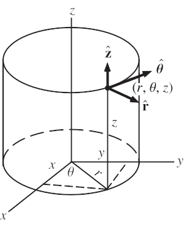

# Komplex számok

## Komplex gyök számítás

$ z^n_k = \sqrt[n]{r}\cdot{}(cos(\frac{\pi{}+2k\pi{}}{n}) + i\cdot{}sin(\frac{\pi{}+2k\pi{}}{n})) $

# Polinomok

## Másodfokú egyenlet megoldóképlete

$ ax^2 + bx + c = 0  $

$ x_{1,2} = \frac{-b \pm{} \sqrt{b^2 - 4ac}}{2a} $

# Deriválás

$ ln'(|x|) = \frac{1}{x} $

$ ( \frac{f}{g} )' = \frac{f'g - fg'}{g^2} $

# Koordinátarendszerek

## Gömbi koordináták

$ x = r\cdot{}sin(\vartheta)\cdot{}cos(\varphi) $  
$ y = r\cdot{}sin(\vartheta)\cdot{}sin(\varphi) $  
$ z = r\cdot{}cos(\vartheta)$

### Jakobi-determinánsa

$ r^2sin(\vartheta) = $

|   | r |            $\vartheta$            | $\varphi$ |
| - | - | --------------------------------- | --------- |
| x |   |                                   |           |
| y |   | $\frac{\partial{}i}{\partial{}j}$ |           |
| z |   |                                   |           |

## Henger koordináták

$ x = r\cdot{}cos(\varphi)$  
$ y = r\cdot{}sin(\varphi)$  
$ z = z $

### Jakobi-determinánsa

$r = $

|   | r |            $\vartheta$            | $\varphi$ |
| - | - | --------------------------------- | --------- |
| x |   |                                   |           |
| y |   | $\frac{\partial{}i}{\partial{}j}$ |           |
| z |   |                                   |           |

# Trigonometria

$ sin(x+y) = sin(x)cos(y) + cos(x)sin(y) $  
$ sin(x-y) = sin(x)cos(y) - cos(x)sin(y) $  
$ cos(x+y) = cos(x)cos(y) - sin(x)sin(y) $  
$ cos(x-y) = cos(x)cos(y) + sin(x)sin(y) $

$ cos^2(x)+sin^2(x) = 1 $

$ sin(2x) = 2sin(x)cos(x) $  
$ cos(2x) = cos^2(x) - sin^2(x) $

$ cos^2(x) = \frac{1+cos(2x)}{2} $  
$ sin^2(x) = \frac{1-cos(2x)}{2} $

